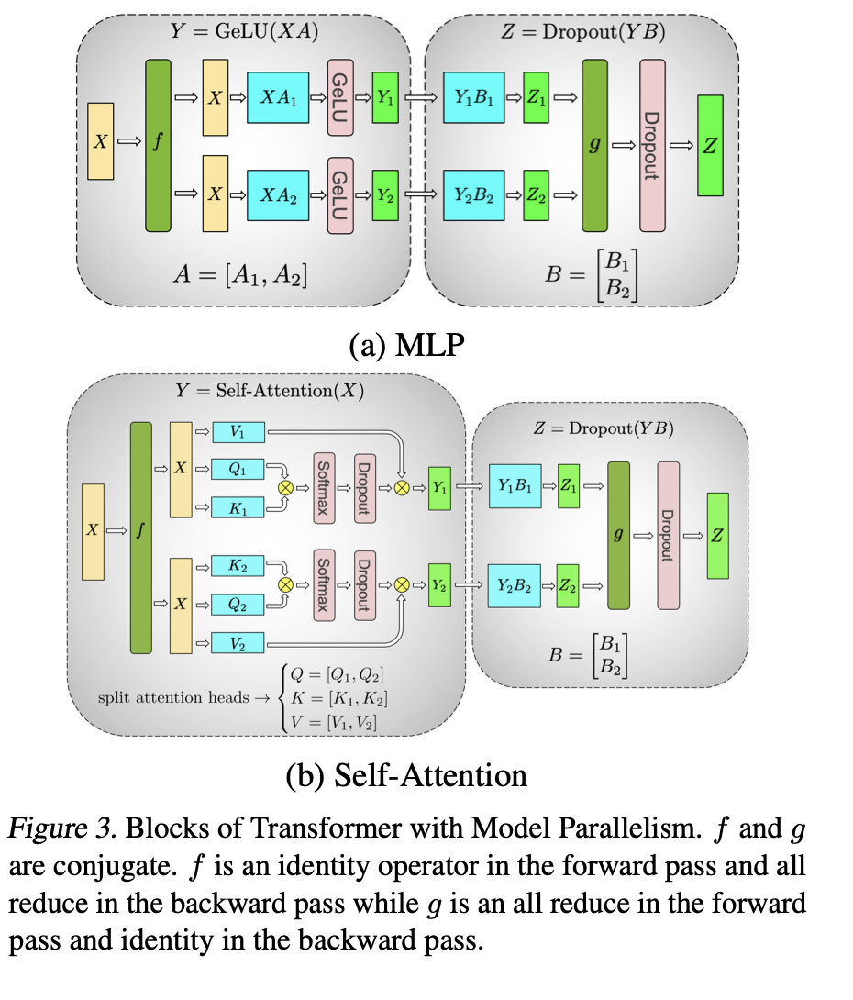
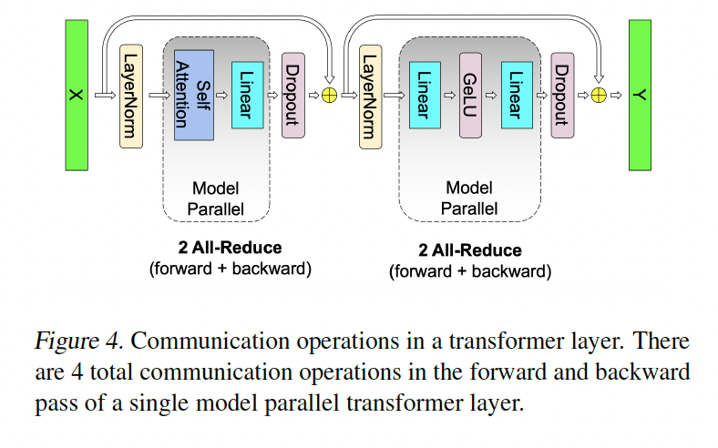

# Take-home exercise results

## Understanding tensor parallelism bottleneck in communication

The following figure from the Megatron-LM paper illustrates the communication bottleneck in tensor parallelism for a transformer layer:

f and g are the communication steps which involve 2 communications per transformer layer(one in the attention block and one in the MLP block). In each of them, one of f and g are identity operators, so 1 communication is needed per sub-block.


### MLP

Note that the usual 2-layer MLP function:
$$f(\mathbf{x}) = \mathbf{x} + \big[ \mathrm{GeLU}[\mathbf{X} \mathbf{A}+\mathbf{b_1}]\big]\mathbf{B}+\mathbf{b_2}$$
can be parallelized by splitting the rows of $\mathbf{A}$ and the columns of $\mathbf{B}$ across 2 GPUs, such that each GPU has $\mathbf{A}_i$ and $\mathbf{B}_i$ with shapes $(d_{model}, d_{ff}/2)$ and $(d_{ff}/2, d_{model})$ respectively. The forward pass can be computed as follows:
1. Each GPU computes its local output: $\mathbf{y}_i = \mathrm{GeLU}[\mathbf{X} \mathbf{A}_i+\mathbf{b_i^{(1)}}]\mathbf{B}_i+\mathbf{b^{(2)}_i}$
2. An all-reduce operation is performed to concatenate the two chunks: $\mathbf{y} = \mathbf{y}_1 

### MHA

### Result of TP
2 communications per transformer layer are needed in the current TP implementation.
note that the bottleneck in a fully tensor parallel implementation is the layer norm and the dropout layers, which require communication to compute the mean and variance across the entire feature dimensions present on multiple machines.

 This is because layer norm normalizes the inputs across the feature dimension, which is split across multiple GPUs in a tensor parallel setup. Therefore, to compute the mean and variance, each GPU needs to communicate with all other GPUs to gather the necessary statistics.
 


## Improvements on TP for less communication
The paper suggested to read (arXiv:2502.20727) offers a key insight: *communication is only necessary when a non-linear operation follows a Column-Parallel step, or before an element-wise operation (like a residual add) follows a Row-Parallel step.*


## Baseline

After instantiating the GPT model, we confirm it has 123.69M parameters with the base config.

```python
bsz = 1
cfg = GPTConfig()
print(cfg)
model = GPT(cfg)
x = torch.randint(cfg.vocab_size, (bsz, cfg.block_size), dtype=torch.long)
logits, loss = model(x, targets=x)
print("logits.shape:", logits.shape)
print("loss:", loss.item())
```
Output:
```
GPTConfig(block_size=1024, vocab_size=50304, n_layer=12, n_head=12, n_embd=768, dropout=0.0, bias=True)
number of parameters: 123.69M
logits.shape: torch.Size([1, 1024, 50304])
loss: 9.931818962097168
```